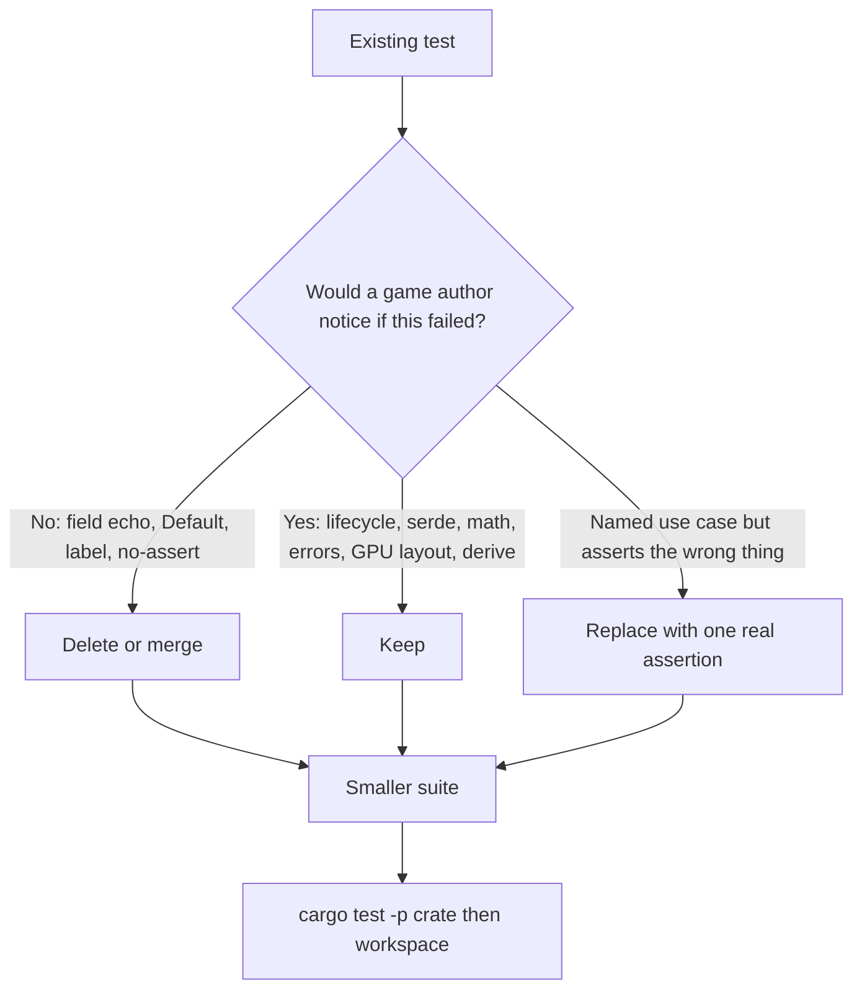

# Requirements

### Overview & Goals

Audit every unit test in the 11 engine crates and leave a suite that fails when a **player- or author-visible contract** breaks — not when a field assignment still assigns. Theater tests are deleted or merged. Real contracts stay. New tests are added only where a real use case is currently untested or faked.

Expected outcome: fewer tests, higher signal. `cargo test --workspace` stays 0 failed / 0 ignored. Hardcoded counts in docs are not treated as an invariant (per `training.md`).

### Scope

#### In Scope
- All 11 workspace crates: `common`, `ecs`, `ecs_macros`, `engine_core`, `input`, `audio`, `ui`, `physics`, `renderer`, `editor`, `editor_integration`
- A written keep/delete rubric, applied consistently
- Delete or merge coverage-theater tests
- Keep contract tests (serde defaults, GPU struct sizes, clamping, scene/sheet round-trip, derive-macro output)
- Add use-case tests only for confirmed gaps found during the pass
- A short “what makes a test meaningful” note in `training.md` so future agents do not reintroduce theater

#### Out of Scope
- Sibling games in `../games/`
- Rewriting every builder test into a fake scenario just to keep the count
- Coverage tooling, CI changes, or a coverage percentage target
- Production behavior changes except tiny extractable helpers when a test currently copies production logic (see editor min-window-size)

### Rubric (the acceptance bar)

A test **stays** if it would catch a regression a game author or player would notice:
- State machine / lifecycle (play→pause→stop, input just-pressed clearing, lifetime despawn)
- Cross-component wiring (`SpriteAnimationSystem` writes `Sprite.tex_region`)
- Persistence contracts (legacy JSON/RON still loads; texture-filter aliases)
- Math with a non-obvious result (capsule half-height, UV non-reciprocal cells, camera bounds, spatial attenuation)
- Error-path typing (`AudioError::IoError` vs `DecodeError`)
- GPU layout sizes the shader assumes
- Derive-macro output (`ecs_macros` `type_name` / `field_names`)

A test **goes** (delete or fold into a sibling) if it only:
- Echoes a constructor/builder field (`with_x(v); assert_eq!(x, v)`)
- Asserts `Default` / `label()` / `type_name()` with no downstream contract
- Constructs and returns (no assert, or “doesn’t panic” with no state check)
- Reimplements production logic inside the test (`if width < 1024` in the test body)
- Duplicates another crate’s tests of the same type (`Transform2D` / `Camera` in both `common` and `ecs/tests/sprite_components.rs`)
- Checks `is_nan` / `is_finite` instead of the named behavior

### User Stories

- As an engine author, I want a failing test to mean a real contract broke, so I trust `cargo test -p <crate>` during iteration.
- As an AI agent, I want a written rubric in `training.md`, so I stop adding `test_foo_builder` field-echo tests.
- As a game author, I want camera screen↔world, input mapping, scene serde, and animation→sprite wiring covered by assertions on the actual outcome.

### Functional Requirements

1. Every remaining test names a behavior (`test_entity_despawns_when_lifetime_crosses_zero`), not a method (`test_new`).
2. No test asserts only that a setter stored its argument.
3. No test copies production `if` logic and asserts against the copy.
4. Confirmed gaps get one focused use-case test each (listed in Technical Design).
5. `cargo test --workspace` and `cargo clippy --workspace` stay clean after each crate cluster.

### Non-Functional Requirements

- Headless only — no GPU/window tests (existing `no_run` doc examples stay).
- Do not grow files past 600 lines; deleting theater should shrink several already-large test modules (`editor_game/tests.rs` is 637 lines).
- Do not update hardcoded “1337 tests” claims except to stop treating the number as a goal.

# Technical Design

### Current Implementation

~1,175 `#[test]` functions across the workspace (plus doc-tests to reach the advertised 1337). Quality is uneven, not uniformly bad.

**Strong models to copy (do not touch except rename if needed):**
- `crates/ecs/src/lifetime.rs` — despawn at T=0.5, independent timers, immortals untouched
- `crates/ecs/src/sprite_system.rs` — system writes `tex_region`, skips spriteless, `dt=0` freezes (pause contract)
- `crates/audio/src/manager.rs` — load/unload, typed IO vs decode errors, disabled no-op still rejects bad handles
- `crates/input/tests/input_mapping.rs` + most of `input_event_queue.rs` — bind/unbind, just-pressed clears on `update`
- `crates/ui/src/text_edit.rs` — selection, backspace, shift-arrow, click-to-cursor
- `crates/editor/src/status_bar.rs` — auto-clear vs persistent error
- `crates/engine_core/src/game_config.rs` serde tests — legacy JSON still parses; `texture_filter` aliases
- `crates/ecs/src/ui_components.rs` — `resolve_anchored_pos` matrix + serde defaults for old scenes
- `crates/common/src/sheet_grid.rs` / `hash.rs` — clamping, non-reciprocal UV, determinism

**Theater clusters (delete or merge):**

 Cluster | Files | Pattern |
---|---|---|
 Constructor echo | `common/src/{time,transform,camera,rect,color}.rs` | `Time::new(0.016, 1.5)` then assert the same numbers; `test_rect_new`; `test_color_constants` (`RED.r == 1.0`) |
 Per-field builders | `renderer/src/sprite.rs` (8 tests), `ecs/tests/sprite_components.rs` `test_sprite_creation`/`default`, `physics/src/components.rs` `test_rigid_body_*`, `ecs/src/audio_components.rs` builders | one test per `with_*` that only reads the field back |
 Duplicate math | `ecs/tests/sprite_components.rs` `test_transform2d_*`, `test_camera2d_*` | same types already tested in `common` |
 Fake named tests | `ecs/tests/sprite_components.rs` `test_camera2d_screen_to_world` / `world_to_screen` | comments admit the methods “don’t exist”; asserts `!matrix.is_nan()`. The methods **do** exist on `common::Camera` and are untested there |
 Enum predicates | `editor/src/play_state.rs` | `is_editing`/`is_playing`/`is_paused` are `==` on the variant; `label()` string literals |
 Theme field copies | `editor/src/theme.rs` | `grid_colors()`, `inspector_style()`, `play_state_border()` assert field == same field |
 Dock constructors | `editor/src/dock/tests.rs` | `PanelId::SCENE_VIEW.0 == 0`, `DockPosition::default()`, `DockPanel::new` field echo |
 Config builders | `engine_core/src/game_config.rs` `test_game_config_default`/`builder`/`with_*`; `window_manager.rs` title/size getters | keep the **serde** tests; drop field-echo |
 No-assert / hollow | `input/tests/input_event_queue.rs` `test_input_event_queue_creation`, `test_window_event_handling` | construct, comment “should not panic”, never call `handle_window_event` |
 Test-of-the-test | `editor_integration/src/editor_game/tests.rs` `test_editor_config_enforces_minimum_size` / `preserves_large_size` | inlines `if width < 1024` instead of calling `run_game_with_editor` (or a helper). Production clamp lives only in `run_game_with_editor` (`editor_game/mod.rs:378–385`) |
 UI construction | `ui/src/context/tests.rs` `test_ui_context_new`/`window_size`/`font_manager_access`; `ui/src/{draw,style,input_state,interaction,font}.rs` `*_new`/`*_default` | empty draw list / default 800×600 / `fonts==0` |

**Keep as contracts (look like defaults, are not theater):**
- `ecs_macros/tests/derive_test.rs` — the crate’s entire job is generating `type_name`/`field_names`
- `renderer` bloom/line `size_of` tests — shader uniform layout
- Volume/speed clamping (`audio`, `ecs` audio components)
- `GameConfig` / `UiLabel` serde defaults for pre-feature JSON
- `test_new_or_disabled_never_fails` — construction must succeed without a device (add one assert: manager is usable, e.g. `play` of a loaded sound is `Ok`)
- `Behavior` RON defaults / `default_for_variant` index round-trip (editor combo box contract)

### Key Decisions

1. **Delete theater; do not rewrite it into fake stories.** A `with_position` setter does not become meaningful by wrapping it in a “player moved” comment.
2. **One rubric, all 11 crates.** Same keep/delete bar everywhere so `editor` and `common` do not drift.
3. **Add tests only for confirmed gaps**, not to replace deleted count.
4. **Extract a helper only when a test currently copies production logic.** First case: `clamp_editor_window_size(config) -> GameConfig` next to `MIN_EDITOR_WINDOW_*` in `editor_integration/src/constants.rs`, called from `run_game_with_editor`.
5. **Document the rubric in `training.md`** (replace the current “Writing Tests” prompt-recipe with the keep/delete bar). Do not add a TECH_DEBT pile for tests we are about to delete.

### Proposed Changes

#### 1. Rubric in `training.md`
Replace the “Writing Tests” prompt block with: test names describe behavior; no field-echo / Default / label / no-assert tests; contracts that stay (serde, GPU layout, clamp, derive); pointer to `ecs/src/lifetime.rs` and `ecs/src/sprite_system.rs` as models.

#### 2. Delete / merge by crate (mechanical, same rubric)

**common** — Delete `test_time_default`/`new`/`with_delta` (keep `test_time_tick`). Delete `test_transform_default`/`builder` (keep `transform_point`/`forward`/`lerp`). Delete `test_camera_default`/`builder`/`camera_uniform` field echo (keep `world_bounds`/`contains_point`). Delete `test_rect_new` (keep contains/intersects/intersection/expand). Delete `test_color_constants` (keep `from_rgb8`/`from_hex`/`lerp`; fold `to_vec4` into the existing conversion test if anything remains unique).

**ecs** — Delete builder/default echo in `audio_components.rs` (keep attenuation + volume clamp). Delete `test_component_meta_names` and `test_defaults_are_visible` in `ui_components.rs` (visibility-on-default is already implied by the serde-defaults test). In `ecs/tests/sprite_components.rs` delete the duplicated `Transform2D`/`Camera` constructor and matrix-is-finite tests; keep the `SpriteAnimation` clip playback block. Merge `resource.rs` `test_len_and_is_empty` into `test_clear_resources` if both only poke the same map.

**renderer** — Collapse `sprite.rs` eight builder tests + `to_instance` into **one** test: a fully built sprite’s `to_instance()` carries position/rotation/scale/color/depth (the only transform that crosses a type boundary). Keep bloom/line `size_of` and `bloom_dimensions_*`.

**physics** — Delete `test_rigid_body_default`/`builder`. Keep `test_collider_builder` only for the non-obvious half-extents (`32x64 → 16x32`) and `test_collider_shapes` capsule math. Keep `CollisionEvent::involves` order-independence.

**engine_core** — Keep all serde / locale / texture-filter alias tests. Delete `test_game_config_default`, `test_game_config_builder`, and the one-line `with_vsync`/`with_chaos_mode`/`with_texture_filter` getters. In `window_manager.rs` keep `resize` + `logical_physical_size` (scale factor is real math); delete title/default/builder/new/size getter tests.

**input** — Delete `test_input_event_queue_creation` and `test_window_event_handling`. Keep queue → process → just-pressed → `update` clears. Keep the whole `input_mapping.rs` file.

**audio** — Merge `test_disabled_manager_reports_not_enabled` and `test_sound_settings_builder` into existing clamp / disabled-play tests. Keep every load/unload/error/id test.

**ui** — Delete `test_ui_context_new`, `window_size`, font-manager access, `test_draw_list_new`, `test_theme_defaults`, `test_input_state_default`, `test_interaction_manager_new`, `test_interaction_result_default`, `test_font_handle_default`/`font_manager_new`. Keep label/panel/hit-test/progress-bar **command contents**, text-edit, and `tests/ui_interaction_debug.rs` click/slider flows. `test_ui_context_panel`/`progress_bar` that only assert `!draw_list.is_empty()` get one extra assert on command kind (or merge into a sibling that already checks kind).

**editor** — Delete `play_state` `is_*` and `label` tests; keep `in_play_session`. Delete theme field-copy tests; keep opaque/distinct accent and play-border color contracts. Delete dock `PanelId` constants, `DockPosition::default`, `DockPanel::new`/`builder`, `DockArea::new`; keep collapse/content-bounds/effective-size (those are layout math). Status bar stays as-is except `test_set_version` / `test_status_bar_default` if they are pure field echo.

**editor_integration** — Extract `clamp_editor_window_size` and point the two min-size tests at it. Delete `test_editor_game_creation` / `font_pins_start_unset` / `command_history_initialized` / `default_panels` if they only read constructor defaults already covered by play/pause/stop. Keep `test_play_pause_resume_stop_cycle` and snapshot restore.

**ecs_macros** — no deletes (derive contract).

#### 3. Real gaps to fill (only these unless the pass finds another equally concrete hole)

1. **`common::Camera` screen ↔ world** in `crates/common/src/camera.rs`: center of an 800×600 view at identity maps to camera position; `world_to_screen(screen_to_world(p))` round-trips; Y-down screen vs Y-up world. Replaces the hollow ecs tests.
2. **`Transform2D::inverse_transform_point` / `transform_direction`** in `crates/common/src/transform.rs`: a translated+rotated point round-trips; direction ignores translation.
3. **Editor min window size** via the extracted helper (640×480 → 1024×720; 1920×1080 unchanged).

No new tests for “Default is Editing” or “Sprite builder sets position”.

### File Structure

No new files. Touched in place:

- Docs: `training.md` (Writing Tests)
- Helpers: `crates/editor_integration/src/constants.rs` (+ call site in `editor_game/mod.rs`)
- Test modules listed in the tables above (delete/merge in situ)

### Architecture Diagram

### Risks

- **Hidden contract in a “default” test.** Mitigation: before deleting `test_*_default`, check for a serde/legacy comment or a non-zero default that games rely on (`UiButton.size`, `GameConfig.texture_filter`, `Behavior` RON defaults). Those stay.
- **Docs that treat 1337 as a goal.** Mitigation: do not “make up” tests; leave AGENTS.md count stale or replace with “run cargo test” (already the rule in `training.md`).
- **Over-deleting dock/editor tests that encode layout constants.** Mitigation: keep any test that computes bounds from `HEADER_HEIGHT` or collapse rules; only drop identity asserts.

# Testing

### Validation Approach

This is a test-suite change. Validation is: the remaining tests still fail when the contract they name is broken, and the workspace stays green. Each crate cluster is checked with `cargo test -p <crate>` before moving on; the last cluster also runs `cargo test --workspace` and `cargo clippy --workspace`.

No GPU/window. No new ignored tests.

### Key Scenarios

- After deleting theater in a crate, a **kept** test still fails if its production code is broken (spot-check by temporarily flipping one assertion locally is unnecessary if we do not edit production logic except the min-size extract).
- `clamp_editor_window_size` is covered by the two rewritten tests (below min / already large).
- New camera tests: identity center, round-trip, Y-axis flip.
- New transform tests: inverse round-trip, direction ignores translation.
- Strong existing suites still pass: `ecs` lifetime + sprite system, `audio` manager, `input` mapping, `ui` text_edit, `engine_core` scene/sheet/game_config serde, `editor` status bar + play cycle.

### Edge Cases

- A test named `test_*_default` that is actually a serde-default contract must not be deleted (`ecs` `UiLabel`, `engine_core` `GameConfig` locale/filter, `ecs` `Behavior` RON).
- `ecs_macros` derive tests stay even though they look like `type_name` asserts.
- Disabled `AudioManager` tests stay: they are the CI-safe stand-in for “no device”.

### Test Changes

- **Delete/merge** the theater listed in Technical Design (on the order of ~80–120 tests; not a target).
- **Add 3 small groups:** camera screen↔world, transform inverse/direction, editor window clamp.
- **Do not add** a test for every deleted builder.

# Delivery Steps

### ✓ Step 1: Write the rubric and clean common, audio, ecs_macros
training.md states the keep/delete bar, and the three smallest crates already follow it.

- Replace the `training.md` “Writing Tests” prompt-recipe with the rubric (behavior names, no field-echo/Default/no-assert, which contracts stay, pointers to `lifetime.rs` / `sprite_system.rs`).
- `common`: delete constructor/default/builder/constants echo in `time.rs`, `transform.rs`, `camera.rs`, `rect.rs`, `color.rs`; keep tick/lerp/bounds/contains/hex/intersection.
- Add `Camera` screen↔world (center, round-trip, Y-down vs Y-up) and `Transform2D` inverse/direction tests in those same files — these replace the hollow ecs camera tests.
- `audio`: merge `test_disabled_manager_reports_not_enabled` and `test_sound_settings_builder` into existing clamp/disabled-play tests; keep load/unload/error/id tests; give `test_new_or_disabled_never_fails` one usability assert.
- `ecs_macros`: leave `derive_test.rs` as-is (derive contract).
- Verify with `cargo test -p common -p audio -p ecs_macros`.

### ✓ Step 2: Clean ecs, physics, and renderer theater
Component/builder echo is gone from ecs, physics, and renderer; animation and collision contracts remain.

- `ecs/tests/sprite_components.rs`: delete duplicated `Transform2D`/`Camera` constructor and `is_nan` tests (including the fake `screen_to_world`/`world_to_screen`); keep the `SpriteAnimation` clip block.
- `ecs/src/audio_components.rs`: delete builder/listener/effect field-echo; keep attenuation + clamp.
- `ecs/src/ui_components.rs`: delete `test_component_meta_names` and `test_defaults_are_visible`; keep anchor matrix + serde defaults.
- Fold trivial `resource.rs` len/empty into an existing insert/clear test if they overlap.
- `physics/src/components.rs`: delete rigid-body default/builder; keep collider half-extents, capsule math, `CollisionEvent::involves`.
- `renderer/src/sprite.rs`: replace the eight builder tests with one `to_instance()` carry-through test; keep bloom/line `size_of` and bloom dimension guards.
- Verify with `cargo test -p ecs -p physics -p renderer`.

### ✓ Step 3: Clean engine_core, input, and ui theater
Config/window getter tests and hollow UI/input construction tests are gone; serde, mapping, and widget command tests remain.

- `engine_core/src/game_config.rs`: delete default/builder/`with_*` getter tests; keep locale + texture-filter serde/alias/typo tests.
- `engine_core/src/window_manager.rs`: keep resize + logical/physical scale math; delete title/default/builder/new/size getters.
- `input/tests/input_event_queue.rs`: delete `test_input_event_queue_creation` and `test_window_event_handling`; leave queue/process/update/gamepad tests.
- Leave `input/tests/input_mapping.rs` intact.
- `ui`: delete `*_new`/`*_default`/font-manager-access tests in `context/tests.rs`, `draw.rs`, `style.rs`, `input_state.rs`, `interaction.rs`, `font/mod.rs`; keep command-content, hit-test, text-edit, and `tests/ui_interaction_debug.rs`. Strengthen any `!draw_list.is_empty()` assert with command kind.
- Verify with `cargo test -p engine_core -p input -p ui`.

### ✓ Step 4: Clean editor and editor_integration; extract min-size helper
Editor constructor/predicate/theme-copy tests are gone; play lifecycle and layout math remain; min-window-size tests hit production code.

- Extract `clamp_editor_window_size` next to `MIN_EDITOR_WINDOW_*` in `crates/editor_integration/src/constants.rs` and call it from `run_game_with_editor` in `editor_game/mod.rs`.
- Rewrite `test_editor_config_enforces_minimum_size` / `preserves_large_size` to call that helper (no inlined `if width < 1024`).
- Delete editor_integration constructor-default tests that only read `EditorGame::new` fields; keep play/pause/resume/stop + snapshot.
- `editor/src/play_state.rs`: delete `is_*` and `label` tests; keep `in_play_session`.
- `editor/src/theme.rs`: delete field-copy tests; keep opaque/distinct color contracts.
- `editor/src/dock/tests.rs`: delete PanelId/default/new/builder/empty-area tests; keep collapse, content bounds, effective size.
- Drop status-bar field-echo (`set_version` / default) if nothing else remains in those tests; keep timeout/persistent-error.
- Verify with `cargo test -p editor -p editor_integration`, then `cargo test --workspace` and `cargo clippy --workspace`.